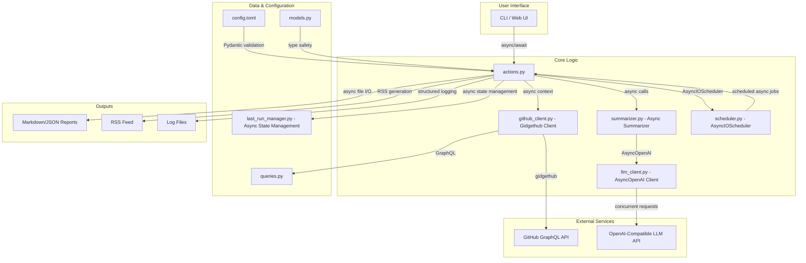

# Project Structure

This document provides a comprehensive overview of the project's async-first architecture, components, and data flow.

## Architecture Diagram

The following diagram illustrates the main components of the async application and their interactions:



## Workflow

The application follows a clear, async workflow to generate repository summaries with high concurrency:

1.  **Initialization**: The process is initiated either through the CLI (`main.py`) or the web interface (`web.py`).
2.  **Configuration Loading**: The `config.py` module loads and validates the user-defined settings from `config.toml` using Pydantic models defined in `models.py`.
3.  **Async Orchestration**: The `actions.py` module orchestrates the main async workflow with configurable concurrency. It processes multiple repositories simultaneously using asyncio semaphores.
4.  **GitHub Data Fetching**: The `github_client.py` module uses gidgethub to send GraphQL queries (defined in `queries.py`) to GitHub's API. Features include automatic rate limiting, retries, and efficient pagination.
5.  **Concurrent Summarization**: The `summarizer.py` module constructs detailed prompts and sends them to the LLM via `llm_client.py` using AsyncOpenAI with configurable concurrent request limits.
6.  **Async Output Generation**: Generated summaries are saved to the filesystem using async file I/O operations (markdown, JSON) and can update RSS feeds via `rss.py`.
7.  **AsyncIO Scheduling**: The `scheduler.py` module uses AsyncIOScheduler for native async cron-based scheduling without blocking the event loop.
8.  **Async State Management**: The `last_run_manager.py` module tracks execution times using async file operations with proper locking for concurrent access.

## Directory Structure

```
├── docs/                     # Documentation
├── examples/                 # Configuration examples
├── github_summary/           # Main source code
├── tests/                    # Test suite
├── config/                   # Configuration files
└── output/                   # Generated files (runtime)
```

## Key Components

### Source Code (`github_summary/`)

| Module                | Purpose                                |
| --------------------- | -------------------------------------- |
| `main.py`             | CLI entry point using Typer            |
| `actions.py`          | Async orchestration and business logic |
| `github_client.py`    | Gidgethub-based GitHub GraphQL client  |
| `llm_client.py`       | AsyncOpenAI integration with retries   |
| `summarizer.py`       | Async AI-powered summary generation    |
| `scheduler.py`        | AsyncIOScheduler for cron scheduling   |
| `rss.py`              | RSS feed creation and management       |
| `web.py`              | FastAPI web service                    |
| `config.py`           | Configuration loading and validation   |
| `models.py`           | Pydantic data models                   |
| `queries.py`          | GitHub GraphQL query definitions       |
| `last_run_manager.py` | Async execution time tracking          |

### Configuration

- `examples/` - Configuration templates for different use cases

### Documentation

- `README.md` - Quick start and overview
- `docs/SETUP.md` - Installation and setup guide
- `docs/CONFIGURATION.md` - Complete configuration reference
- `docs/API.md` - Technical API documentation
- `GEMINI.md` - AI assistant development context

## File Conventions

### Generated Files (Runtime)

- `output/rss.xml` - RSS feed file
- `output/*_summary.json` - Raw data reports
- `output/*_summary.md` - AI-generated summaries
- `log/github_summary.log` - Application logs
- `log/last_run_times.json` - Execution tracking

### Development Files

- `pyproject.toml` - Project dependencies and metadata
- `uv.lock` - Dependency lock file
- `tests/` - Test suite with pytest
- `.gitignore` - Git ignore patterns
- `Dockerfile` - Container configuration

This structure provides clear separation of concerns and makes the project easy to navigate and maintain.

